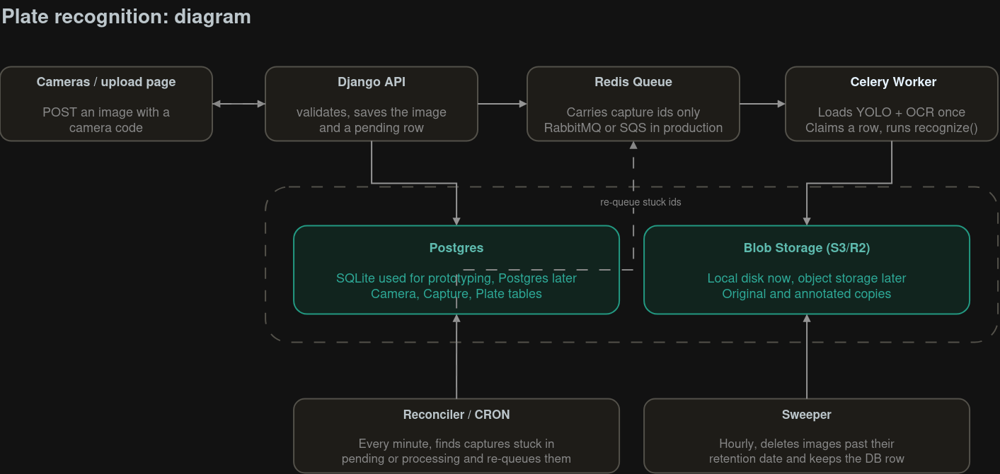

# License Plate Recognition System

### Setup Instructions

##### Local Development
```bash
# 1. Start Redis
redis-server

# 2. Start Celery Worker
celery -A lprecognition worker -l info -c 4

# 3. Start Django
python manage.py runserver 0.0.0.0:8000

# 4. (Optional ) Start Reconciler
python manage.py reconcile # or cron every minute
```

#### Docker
```bash
# Build and start all services
docker-compose up --build -d

# Services:
# - web: http://localhost:8000
# - celery: 4 workers
# - cron: reconcile (every min) + purge (daily 2AM)
# - redis: port 6379

# View logs
docker-compose logs -f web
docker-compose logs -f celery
docker-compose logs -f cron
```

  
#### Environment Variables
```bash
REDIS_URL=redis://localhost:6379/0
DEBUG=1

PLATE_MODEL_PATH=models/best.pt
PLATE_OCR_MODEL=cct-s-v2-global-model
PLATE_DET_CONF=0.25

```
---
### Approach: 

Since the question statement focuses on pocessing the images and determines the registration number, the use cases are is open ended.

It could be:
- The use cases could be when vechicle stops at tollgate to get tickets, camera can get clear image of vechicle ( only one registration number in the image ).
- Else it could be automatic recognition where images taken when vechicle is moving through tollgate.
- Else it could be set on highways where each image could get more than one vechicle and registration plate. 

Possible problems came to mind at the time:

-  Not every image could be recognizable. Should retry or let know.
- N images could be send at same time. Ensure no images are dropped.
- Accuracy might vary if camera angle changes then the trained dataset.
- Might process same image again and again

### My simple approach was: 

images ---> POST API ---> saves in BLOB storage & creates row in DB with 'processing' status'--> presigned url ---> backend (recognizer) --> updates the DB and its status.

###### Analyzed problems with basic approach are:
- Slows down when images increases. 
- Not efficient in handling simultaneous request.
- handle duplicate image from processing are storing.
- Blob storage may fill, so image have to freed after some time. 
  
### Second and Final Approach for prototype: 

#### Architecture




Recognition is the core but here the system build around it is what important. So I focused more on designing that system. Design details explained in working in detail.

### Features Implemented

#### Asynchronous Processing with Queue (Celery + Redis)

-  Problem -  Image processing is CPU-intensive (~28s per image)
-  Solution : Client upload returns in ~50ms, processing happens in background
-  Result : Server stays responsive, 500+ concurrent uploads supported

#### Horizontal Scaling

-  Celery Workers : Add more workers for throughput (`celery -c 8` for 8 concurrent)
-  Gunicorn : Multiple web workers for concurrent ingestion (`gunicorn -w 4`)
-  Stateless : Workers can run on separate machines

#### Reliability & Fault Tolerance

-  Reconciler : Management command (`reconcile`) finds stuck captures every minute
-  Idempotency : Duplicate uploads with same key return existing result
-  Atomic Processing : Database transaction ensures plates saved or none
-  Graceful Failure : Failed captures marked `FAILED` with error, don't block queue

#### Pretrained Model:

 - Trained YOLOv11 model with a [dataset](universe.roboflow.com/mochoye/license-plate-detector-ogxxg/dataset/2) from roboflow for Recognizer, we can improve the accuracy afterwards.

#### Sweeper (Purge)

-  Automatic Expiry : Images purged based on outcome
- SUCCESS: 15 days
- INVALID_FORMAT, LOW_CONFIDENCE, UNREADABLE, INVALID_IMAGE, FAILED: 30 days
- NO_PLATE_DETECTED: 3 days
-  Management Command : `purge_images` with `--dry-run`, `--batch-size`, `--loop`
-  API : Returns `null` for purged image URLs, DB row preserved with text/confidence

#### Monitoring
-  Flower : Optional Celery monitoring at `:5555` (we can set it in compose file)
-  Redis Queue : `redis-cli llen celery` for queue depth
-  Logs : Structured logging for all operations
---
### Working:
#### Project Structure
```

license-plate-project/

├── lprecognition
│   ├── asgi.py
│   ├── celery.py
│   ├── settings.py
│   ├── urls.py
│   └── wsgi.py
├── media
├── models                          # pretrained model
│   └── best.pt
├── README.md
├── recognition
│   ├── management
│   │   └──commands
|	│       ├── reconcile.py           # reconcile script
|	│       ├── purge_images.py        # sweeper script
│   ├── services
│   │   ├── pipeline.py           # YOLO + OCR pipeline
│   │   ├── processing.py         # Save results, set sweeper date
│   │   └── validation.py         # Plate format validation 
│   ├── templates/html
│   ├── admin.py
│   ├── models.py                      
│   ├── tasks.py                       # Celery tasks
│   └── views.py                       # API endpoints
├── sample_inputs
├── benchmark_queue.py
├── simulate_cameras.py
└── tests
    ├── test_api.py
    ├── test_purge.py
    ├── test_reconcile.py
    ├── test_tasks.py
    └── test_validation.py
├── cron                                    # reconcile + purge jobs
├── db.sqlite3
├── docker-compose.yml
├── Dockerfile
├── requirements.txt
├── manage.py


```
#### Work flow:

 - Camera sends image with camera_id. Checks for dedupe with idempotency key.
 - Validates the image edge case.
 - Creates a row in DB  mark it as 'pending', so even worker dead, image or process won't be forgotten.
 - image passed to Blob storage to save the raw image. (used local storage in Prototype)
 - image id will be passed to queue, queue will pass it to Worker. 
 - If image stayed for long in queue, worker dead while processing, here we use reconciler. 
 - Reconciler check for process in-time, and calculate the difference, if status stayed 'pending' then it will re-queue them. It gives 3 attempts to each.  Reconciler rules explained below.
 - Sweeper cleans the image to prevent raw images fills out the storage and brokes our system.


- Django API : 
	- Validates images with basic edge cases. 
	- Checks for dedupe
	- Creates a row in DB with 'pending' status row, so nothing is lost even queue or worker crashed.
	
- Queue (Redis) :
	- Holds one small message per capture (the id only). If workers are busy or down, messages wait instead of being dropped.
	- If dropped from queue, the row will be 'pending' so reconciler will retry again.
	
-  Celery worker:
	- Loads the model when worker initiated.
	- takes an id and claims the row.
	- If worker crashed, status marked as 'failed' so reconciler will take care of it.

- DB: 
	- Planned for Postgres, protoype with sqlite
	- It has separate model for cameras to hold camera details, captures for process details and plates for the output.

- Blob Storage(S3): 
	-  Prototyped with local file. It contains original image and processed image.
	- It maybe filled in future, so we have  sweeper  here to clean up the space eventually. 

-  Reconciler: 
	- A loop that finds if the queue lost( request never queued, queued over 10 mins ago or worker dead) will queue them and run again. 
	- After 3 attempts marks the it as 'failed' in DB
	- I would recommend to deploy this cron in Cloudflare workers or other providers if we don't want a cron to run on our server every minute and every day(sweeper). I made it work in own server for better showcase.
	  
| Reconciler rule                    | Cause                         | Fix                            |
| ---------------------------------- | ----------------------------- | ------------------------------ |
| PENDING, queued_at=NULL            | Redis down during enqueue()   | Re-queue                       |
| PROCESSING, locked_at > 5min ago   | Worker crashed mid-processing | Reset to PENDING, re-queue     |
| PENDING, attempts > 3	Kept failing | Kept failing                  | Mark FAILED (or keep retrying) |

-  Sweeper: 
	-  Setting sweeper should be based on the functional requirement, in our case, I set up sweeper for prototyping with assumption in requirement. 
	- Disk/Blob storage will fill and system may broke there, so deleting the images but keeping the DB rows. 
	- Runs daily at 2 am

| Outcome                                                           | Days | Reason for decision                                                                                                                                                     |
| ----------------------------------------------------------------- | ---- | ----------------------------------------------------------------------------------------------------------------------------------------------------------------------- |
| SUCCESS                                                           | 15   | If we are deleting means, we don't need successfully recognized plates.                                                                                                 |
| INVALID_FORMAT, LOW_CONFIDENCE, UNREADABLE, INVALID_IMAGE, FAILED | 30   | These could be used again for our model trainning, so we can increase our model accuracy and t needs human review.                                                      |
| NO_PLATE_DETECTED                                                 | 3    | Our model is trained enough to find plates, if still plate not found, there might be no plates. <br>Still there is possibilites for plate is too zoom out to recognize. |

---
#### Production Grade updation:

- Broker : Move to RabbitMQ because Reddis Queue used here to build the prototype.
- DB : sqlite to Postgres.
- Cloud file storage : use S3 or R2
- Add auth to camera API endpoint
- GPU workers for faster inference
- Implement batching if vollume of images scales for better GPU utilization
- Gunicorn
---
### API Endpoints

| Method | Endpoint                | Description                                                 |
| ------ | ----------------------- | ----------------------------------------------------------- |
| POST   | `/api/captures/`        | Upload image (returns 201 with capture UUID)                |
| GET    | `/api/captures/`        | List captures (filter: `?camera=`, `?status=`, `?outcome=`) |
| GET    | `/api/captures/{uuid}/` | Get capture details                                         |
| GET    | `/api/cameras/`         | List cameras                                                |
| GET    | `/api/health/`          | Health check                                                |

---
### Design Decisions
********
#### Trained model and OCR
- Trained YOLOv11 model with roboflow dataset,  not focusing on model accuracy. 
- Focused on designing the system around it.
- Used exsiting fast_plate_ocr model for OCR to save time for development.
- Recongnizer is the core but here in our case I chose to design the system around it because accuracy could be developed after better reliable design.
#### Why Celery + Redis?
- Proven: Battle-tested, used by Instagram, Mozilla.
- Simple: No separate broker cluster needed for prototype
- Scalable: Can move to RabbitMQ + Celery
#### Why SQLite?
- Prototype simplicity
- Easy to swap for PostgreSQL (change `DATABASES` setting)
#### Idempotency Key
- Prevents duplicate processing on network retries
- Client generates UUID per frame, Server returns existing result if key matches
- In future, we can hash the raw image and add it in redis, so if same image passed with different idempotency key. 
#### Storage clean up
- Balances storage vs. audit needs
- Configurable via `RETENTION_DAYS` dict
- Sweeper preserves DB rows (plates, confidence) for analytics
---
### Assumptions

1. Images < 10MB (enforced in view)
2. Indian license plate format (validation in `services/validation.py`)
3. Single-line plates (OCR model limitation)
4. CPU-only inference (no GPU in prototype)
5. Trusted cameras (no auth in prototype)
6. Local file storage (media/ directory)
---
### Limitations

| Limitation            | Mitigation                              |
| --------------------- | --------------------------------------- |
| No GPU acceleration   | Add `onnxruntime-gpu`, use CUDA workers |
| SQLite concurrency    | Migrate to PostgreSQL for production    |
| No auth on Camera API | Add API keys / JWT per camera           |
| No rate limiting      | Add Django Ratelimit or Nginx           |
| Single OCR model      | Add model versioning for A/B testing    |

---

### Test:

- Test all existing feature. 
```bash
# Run all tests
python manage.py test
```

- To test for simultaneously multiple camera at a time, use simulate camera.

```bash
# Load test (requires running server + workers)
python simulate_cameras.py --cameras 5 --per-camera 10 --wait
# Benchmark file made with analyzed data while using app.
python benchmark_queue.py # data in this file are gathered from log.

```
---
### Scalability & Production Considerations

#### The number of images increased significantly.

- Images will be queued so no drop. Even if queue dropped, Reconciler DB polling make sure to re-queue the image for worker.
- Add more Celery Worker across machines
- If S3 bucket filled up, sweeper keeps the storage clean.
- If no. of images hit the API and it became bottleneck, add gunicorn ( -w 4)

#### Multiple Cameras Sending Simultaneously

- Idempotency keys prevent duplicate processing on retries
- Queue will handle Multiple camera job allocation.
- If Multiple camera hit the API and it became bottleneck, add gunicorn ( -w 4)
- Rate limiting (add Django Ratelimit or Nginx `limit_req`) protects against abusive cameras

#### CPU/GPU-Intensive Processing

- Currently CPU-only running model, let's put in on GPU Workers
- Batching the images: accumulate N images, run inference once (better GPU utilization)
-  Shared model server (Triton, TorchServe) or worker-local cache 
  
#### Unprocessable Images (Failures)

- Failed should be viewed by develop so we could use it to train our model. 
- In current porototype, 
	- `INVALID_IMAGE` (400), no queue 
	- `NO_PLATE_DETECTED` outcome, 3-day retention 
	- `LOW_CONFIDENCE` / `INVALID_FORMAT`, 30-day retention for review 
	- Reconciler detects `PROCESSING` > 5min → re-queues (max 3 attempts)
	- `FAILED` status, error logged, 30-day retention
	- `attempts > 3` stops retry; alert on `FAILED` spike
---
#### Production Reliability

Current : 
- Docker compose for  reliable deployment

Suggestion :
- Set up monitoring
- use Gunicorn
- Currently worker in single machine, deploy it in K8s Deployement
- Auth for per camera, and JWT for admin
- Redis for prototype, use RabbitMQ for prod
- SQlite for prototype, use Postgres for prod
- Set up S3/R2 file storage instead of local storage
---

  

